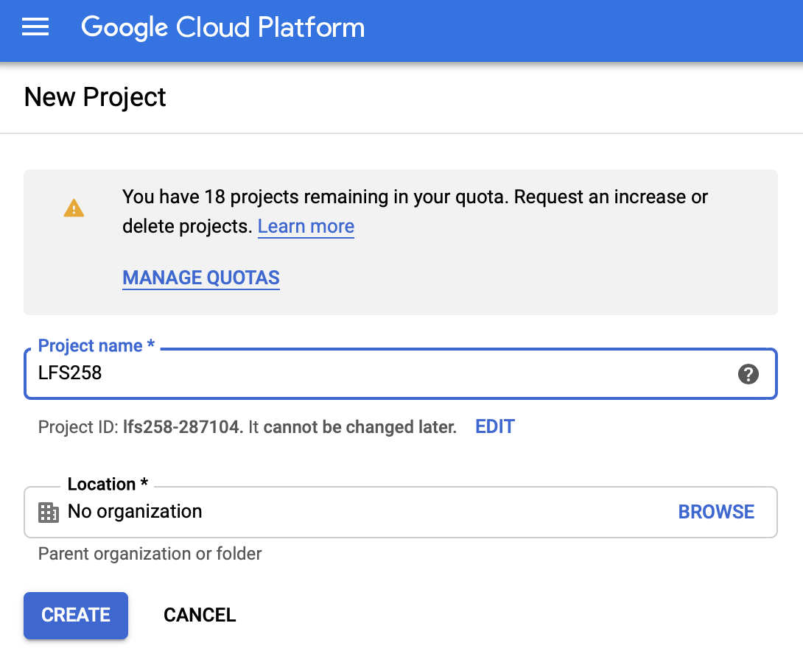
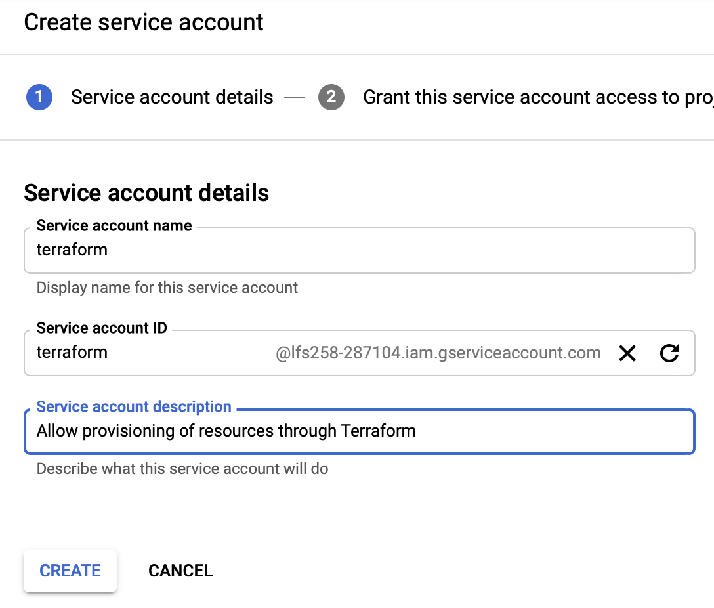
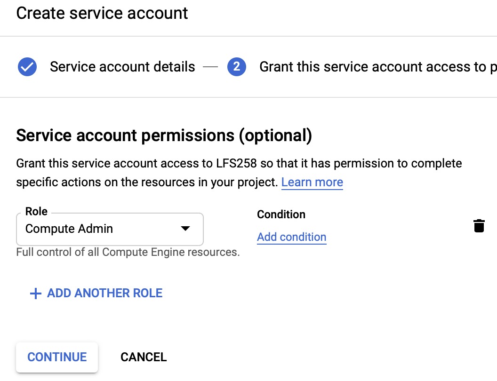
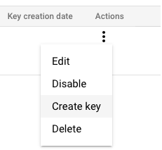
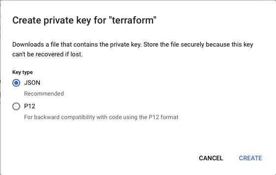

# Kubernetes Fundamentals (LFS258)

This repository contains the necessary infrastructure to run the labs in the LFS258 course.

## Requirements

* GCP account
* Terraform Cloud account
* GCP project (manually set as not organization will be created)

## Setup

### GCP project

Set up a new GCP project for the course, in this case I will be calling it `LFS258`.

1. Click on the projects list in the upper menu bar
2. Click on new project
3. Fill in the name as shown in the image below

### Service account

Create a service account for Terraform, which will have admin permissions in order to be able to provision the various resources we will be using.

1. Go to IAM & Admin.
2. Click on Service Accounts.
3. Click con Create Service Account.
4. Fill in the name and description as shown in the image below.

Set up the permissions, give it permission to only those APIs that will be needed, in this case:

* Compute Engine Administrator

Finally click Done.

### Access Key

Create a new Access Key for the service account.

1. Go to IAM & Admin
2. Click on Service Accounts
3. Click on the three dots on the far right of the service account you created in the last section.
4. Click on Create Account
5. Choose JSON and click Create.

### Configure Terraform Cloud

This assumes you have created a Terraform Cloud (TC) account and organization.

Create a workspace as specified in [this Terraform documentation](https://learn.hashicorp.com/tutorials/terraform/cloud-workspace-create?in=terraform/cloud-get-started).

Configure the json key you generated in the last section:

1. Open it with your favorite editor.
2. Replace the new line characters for an empty string: You can do this in Visual Studio Code by searching the new line character (Ctrl+Enter) and replace it by nothing (empty string).
3. Copy the file content.
4. Create the `GOOGLE_CREDENTIALS` variable in you TC workspace as described in [this article](https://learn.hashicorp.com/tutorials/terraform/cloud-workspace-configure?in=terraform/cloud-get-started), mark the *Sensitive* checkbox.

## Applying changes

Queue a plan in terraform with the resources available in this repository.
